  <h3><code>vinicius@github ~ $ ./contributions.sh</code></h3>
  
    
  <h3><code>vinicius@github ~ $ whoami</code></h3>
  <table>
    <tr>
      <td valign="top"></td>
      <td valign="top"></td>
    </tr>
  </table>

  <a href="mailto:viniciusbertoquintino@gmail.com">viniciusbertoquintino@gmail.com</a>
  ·
  <a href="https://www.linkedin.com/in/vin%C3%ADcius-berto-5b1425139/">LinkedIn</a>

## Projetos

| Projeto | O que é hoje |
|---|---|
| [Pix Race](https://github.com/viniciusbertoquintino/jev-testes/tree/main/jev-pix-falso) | Demo em tela dividida (Rust + Jev e Python + DeepSeek) que classifica golpe de Pix e rastreia o caminho do dinheiro num grafo. Os dados são simulados. |
| [Jev Self-Driving Sim](https://github.com/viniciusbertoquintino/jev-testes/tree/main/jev-carro-autonomo) | Carro 2D no browser. O Jev responde quatro perguntas tipadas e o código aplica o gating de confiança. O modo Compare roda o mesmo percurso contra um LLM. |
| [Production RAG](https://github.com/viniciusbertoquintino/production-rag) | RAG com qualidade de retrieval, avaliação e observabilidade. Em desenvolvimento. |
| [Plataforma de Assistentes com IA](https://github.com/viniciusbertoquintino/plataforma-assistentes-ia) | Plataforma funcional de LLMs, RAG e agentes (React, Supabase e FastAPI opcional). A evolução segue o roadmap do projeto. |

Também: [Desafios GenAI (KPMG)](https://github.com/viniciusbertoquintino/KPMG-Desafios-GenAI-Vinicius-Berto-Quintino), [caderno de estudos](https://github.com/viniciusbertoquintino/meu-caderno-ia) e [quadro de agentes](https://github.com/viniciusbertoquintino/quadro-agentes) — desenvolvimento incremental; o app ainda não existe.

Backlog: [projetos-nao-iniciados/README.md](projetos-nao-iniciados/README.md)

English

## Projects

| Project | What it is today |
|---|---|
| [Pix Race](https://github.com/viniciusbertoquintino/jev-testes/tree/main/jev-pix-falso) | Split-screen demo (Rust + Jev and Python + DeepSeek) that classifies Pix scams and traces the money through a graph. The data is simulated. |
| [Jev Self-Driving Sim](https://github.com/viniciusbertoquintino/jev-testes/tree/main/jev-carro-autonomo) | A 2D car in the browser. Jev answers four typed questions and the code applies confidence gating. Compare mode runs the same course against an LLM. |
| [Production RAG](https://github.com/viniciusbertoquintino/production-rag) | RAG with retrieval quality, evaluation, and observability. In progress. |
| [AI Assistants Platform](https://github.com/viniciusbertoquintino/plataforma-assistentes-ia) | A working LLMs, RAG, and agents platform (React, Supabase, and an optional FastAPI backend). It moves forward on its own roadmap. |

Also: [GenAI challenges (KPMG)](https://github.com/viniciusbertoquintino/KPMG-Desafios-GenAI-Vinicius-Berto-Quintino), [study notebook](https://github.com/viniciusbertoquintino/meu-caderno-ia) and [agent board](https://github.com/viniciusbertoquintino/quadro-agentes) — incremental development; the app does not exist yet.

Backlog: [projetos-nao-iniciados/README.md](projetos-nao-iniciados/README.md)

