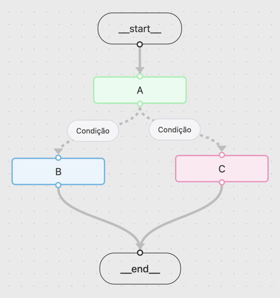

# Introdução ao LangGraph

Como vimos anteriormente, o **LangChain** oferece ferramentas para trabalhar com
LLMs de forma geral. Você pode usá-lo em várias partes do seu código, porém,
quando precisamos lidar com fluxos de dados mais complexos, o **LangGraph**
torna tudo bem mais simples e organizado.

---

## Como funciona o LangGraph?

Em vez de encadear chamadas de forma rígida, no LangGraph trabalhamos no formato
de **grafo** (_graph_). Isso significa que temos **nós** (_nodes_) conectados
por **arestas** (_edges_).

- **Nós (nodes)** - funções que executam uma ação (podem chamar uma LLM ou só
  rodar código).
- **Arestas (edges)** - determinam qual nó será executado em seguida.
  - Podem ser **condicionais** (_conditional edges_), apontando para diferentes
    nós dependendo de uma condição.

Outro ponto importante: os grafos do LangGraph trabalham com **estado**. Cada nó
recebe o estado como entrada e pode retornar o estado atualizado.

Veja um exemplo de grafo simples:

---

## O mínimo necessário para criar um grafo no LangGraph

- **State** - define o estado do grafo (pode ser um `TypedDict`, uma `dataclass`
  ou um modelo `Pydantic`).
- **Nodes** - funções que recebem o estado como input, executam ações e retornam
  o estado atualizado.
- **Edges** - conexões entre nós, podendo ser simples ou condicionais.

> Observação: estamos falando do **mínimo necessário** aqui. Em aulas futuras
> vamos detalhar melhor as nuances, principalmente na parte de estado.

---

## Vamos falar de código

Chega de teoria por agora e vamos analisar dois códigos:

- Um grafo simples apenas com **estado**, **nós** e **arestas** -
  [ex003_1.py](../src/examples/ex003/ex003_1.py)
- Um grafo exatamente como a imagem deste texto, com **estado**, **nós**,
  **arestas** e **arestas condicionais** -
  [ex003_2.py](../src/examples/ex003/ex003_2.py)

---
