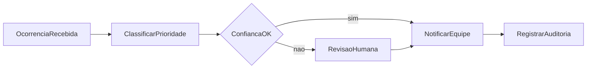

# Fluxos — diagramas para visualizar

Galeria de **diagramas do mesmo caso de negócio** (triagem de incidente de segurança), em notações inspiradas em ferramentas de fluxo, automação e IA. Não há código executável aqui — só documentação visual.

Caso alinhado conceitualmente ao backlog [classificador-incidentes](../projetos-nao-iniciados/classificador-incidentes/README.md), sem descrever um produto já em produção.

## Como visualizar no Cursor

1. Abra qualquer arquivo `.md` desta pasta.
2. Use **Open Preview** (`Ctrl+Shift+V` no Windows) ou o ícone de preview na barra do editor.
3. Os blocos `mermaid` renderizam no preview (e no GitHub ao publicar o repositório).

Para o desenho editável em GUI, abra [drawio/triagem-incidente.drawio](drawio/triagem-incidente.drawio) em [diagrams.net](https://app.diagrams.net).

## Índice

| Documento | Conteúdo |
|-----------|----------|
| [caso-referencia.md](caso-referencia.md) | Narrativa, atores, entradas/saídas, glossário |
| [diagramas/01-processo-negocio.md](diagramas/01-processo-negocio.md) | BPMN simples com swimlanes |
| [diagramas/02-automacao-lowcode.md](diagramas/02-automacao-lowcode.md) | Visões n8n, Zapier, Power Automate |
| [diagramas/03-orquestracao-e-dados.md](diagramas/03-orquestracao-e-dados.md) | Temporal, Airflow/Prefect, GitHub Actions |
| [diagramas/04-agentes-llm.md](diagramas/04-agentes-llm.md) | LangGraph, CrewAI/AutoGen |

## Visão geral do caso

