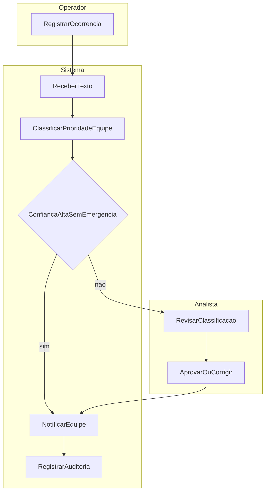
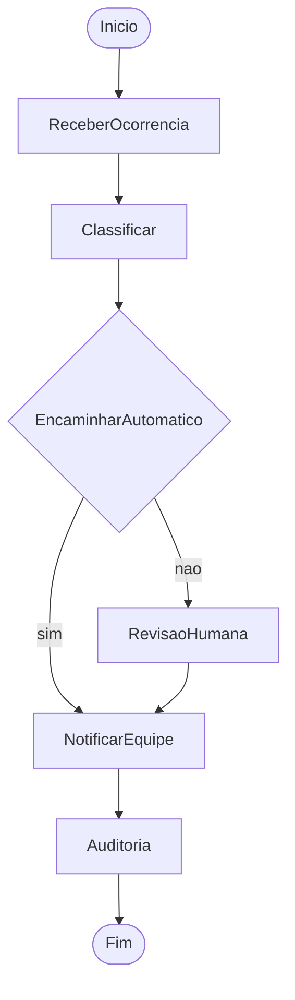

# Processo de negócio (BPMN simples)

Fluxo com swimlanes: Operador, Sistema e Analista.

## Swimlanes

```mermaid
flowchart TB
  subgraph laneOperador [Operador]
    A1[RegistrarOcorrencia]
  end
  subgraph laneSistema [Sistema]
    B1[ReceberTexto]
    B2[ClassificarPrioridadeEquipe]
    B3{ConfiancaAltaSemEmergencia}
    B4[NotificarEquipe]
    B5[RegistrarAuditoria]
  end
  subgraph laneAnalista [Analista]
    C1[RevisarClassificacao]
    C2[AprovarOuCorrigir]
  end
  A1 --> B1
  B1 --> B2
  B2 --> B3
  B3 -->|sim| B4
  B3 -->|nao| C1
  C1 --> C2
  C2 --> B4
  B4 --> B5
```

## Versão compacta (sem lanes)

```mermaid
flowchart TD
  Start([Inicio]) --> Receber[ReceberOcorrencia]
  Receber --> Classificar[Classificar]
  Classificar --> Gate{EncaminharAutomatico}
  Gate -->|sim| Notificar[NotificarEquipe]
  Gate -->|nao| Revisar[RevisaoHumana]
  Revisar --> Notificar
  Notificar --> Auditar[Auditoria]
  Auditar --> Finish([Fim])
```
