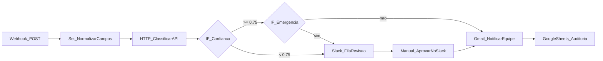
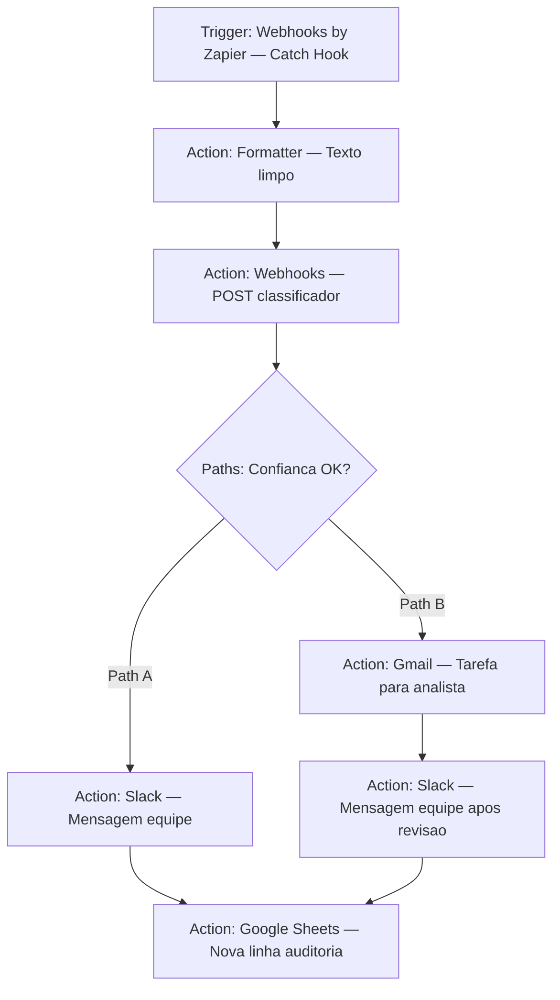
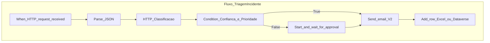

# Automação low-code — mesma triagem, três notações

## Estilo n8n (grafo com nós e IF)

Cada caixa equivale a um nó no editor visual; ramificações com nó de condição.

## Estilo Zapier (cadeia linear)

Zaps costumam ler como trigger → ações em sequência; ramificações viram Zaps separados ou Paths (aqui, dois caminhos após um “Path” conceitual).

## Estilo Power Automate (gatilho + ações em nuvem)

Subgrafos representam escopo de fluxo cloud e ramo condicional.

