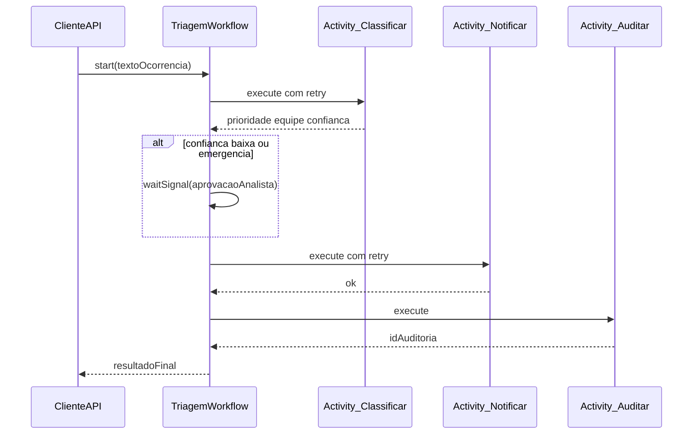
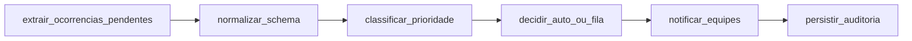
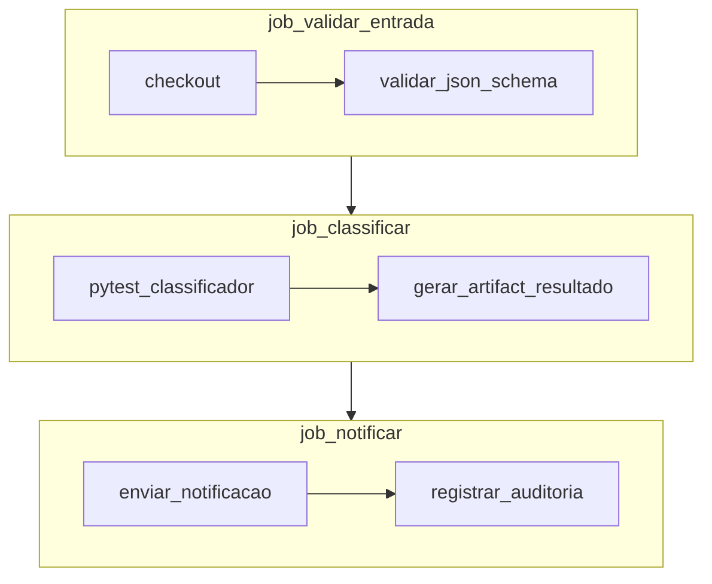

# Orquestração e pipelines — mesma triagem

## Temporal (workflow durável — sequência com retentativas)

Atividades com retry; o workflow mantém estado até concluir.

## Airflow / Prefect (DAG de dados)

Tarefas batch ou micro-batch; dependências explícitas entre tasks.

## GitHub Actions (analogia de pipeline de entrega)

Jobs em paralelo ou sequência — aqui mapeados como **validar entrada → testar classificador → publicar notificação** (metáfora de CI aplicada ao fluxo).

