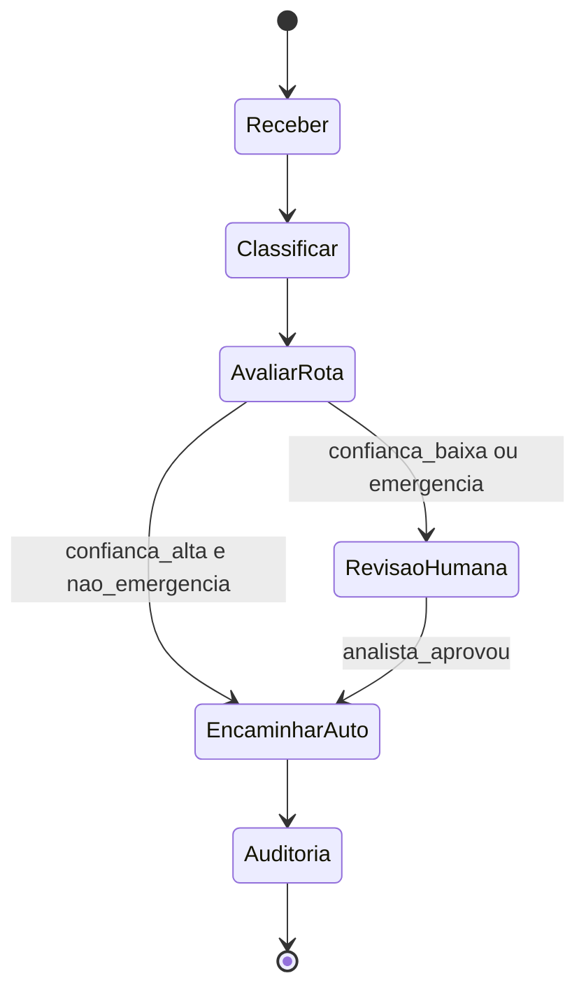
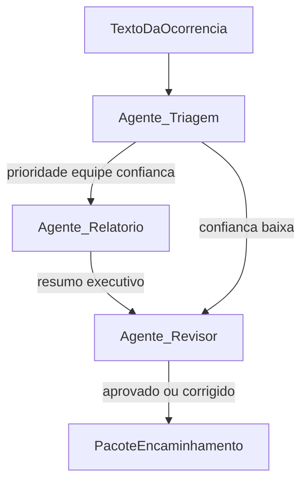
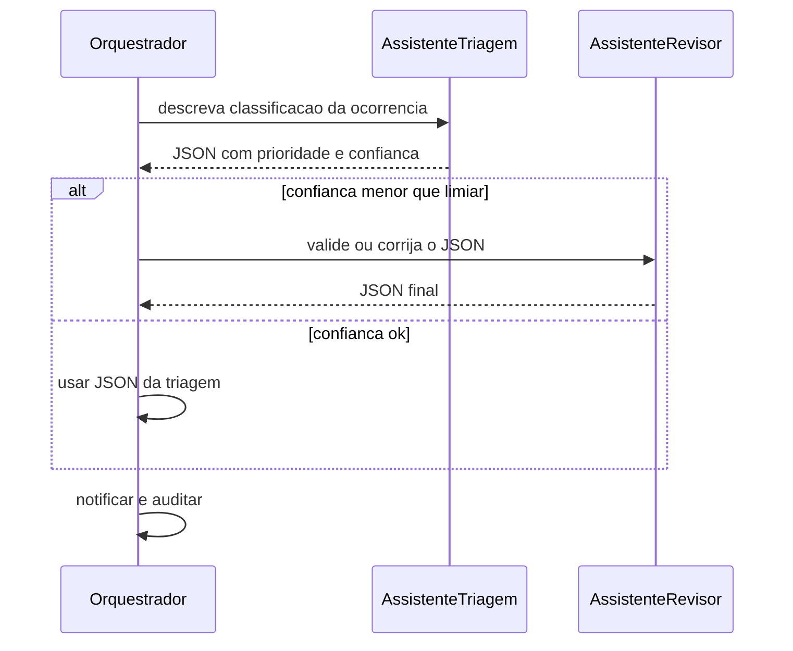

# Agentes e LLM — mesma triagem

## LangGraph (máquina de estados)

Estados e transições condicionais; ramo `humano` para revisão.

## CrewAI / AutoGen (papéis colaborativos)

Agentes com responsabilidades distintas; setas indicam handoff de artefato (texto estruturado).

## Loop conversacional (visão AutoGen)

Dois papéis alternando até critério de parada (stub de multi-turn).

