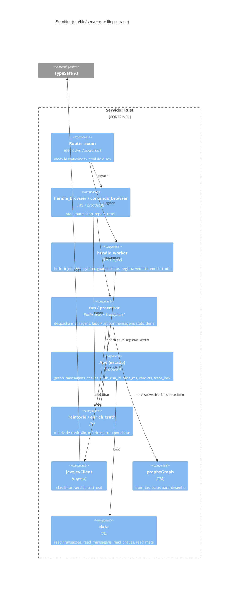
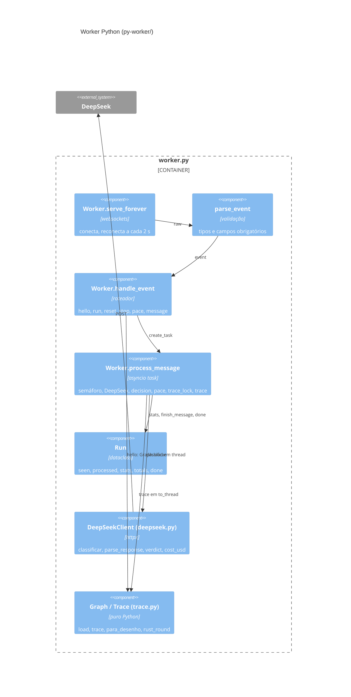
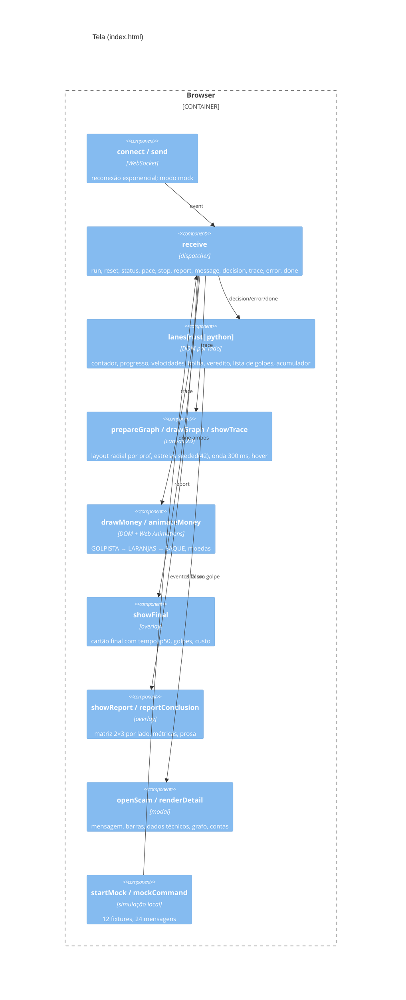

# C4 Nível 3: Componentes

> Gerado pelo Architect (Reversa) em 2026-09-21. 🟢

## Servidor Rust

```mermaid
C4Component
    title Servidor (src/bin/server.rs + lib pix_race)
    Container_Boundary(server, "Servidor Rust") {
        Component(router, "Router axum", "GET /, /ws, /ws/worker", "index lê static/index.html do disco")
        Component(browserws, "handle_browser / comando_browser", "WS + broadcast", "start, pace, stop, report, reset")
        Component(workerws, "handle_worker", "WS + mpsc", "hello, injeta side=python, guarda status, registra verdicts, enrich_truth")
        Component(run, "run / processar", "tokio tasks + Semaphore", "despacha mensagens; lado Rust por mensagem; stats; done")
        Component(app, "App (estado)", "Arc<App>", "graph, mensagens, chaves, truth, run_id, pace_ms, verdicts, trace_lock")
        Component(relatorio, "relatorio / enrich_truth", "fn", "matriz de confusão, métricas; truth por chave")
        Component(jev, "jev::JevClient", "reqwest", "classificar, verdict, cost_usd")
        Component(graph, "graph::Graph", "CSR", "from_txs, trace, para_desenho")
        Component(data, "data", "I/O", "read_transacoes, read_mensagens, read_chaves, read_meta")
    }
    System_Ext(jevapi, "TypeSafe AI")
    Rel(router, browserws, "upgrade")
    Rel(router, workerws, "upgrade")
    Rel(browserws, run, "spawn(run)")
    Rel(run, jev, "classificar")
    Rel(run, graph, "trace (spawn_blocking, trace_lock)")
    Rel(run, relatorio, "enrich_truth")
    Rel(workerws, relatorio, "enrich_truth, registrar_verdict")
    Rel(browserws, relatorio, "report")
    Rel(app, data, "boot")
    Rel(jev, jevapi, "POST")
```

## Worker Python

```mermaid
C4Component
    title Worker Python (py-worker/)
    Container_Boundary(worker, "worker.py") {
        Component(serve, "Worker.serve_forever", "websockets", "conecta, reconecta a cada 2 s")
        Component(parse, "parse_event", "validação", "tipos e campos obrigatórios")
        Component(handle, "Worker.handle_event", "roteador", "hello, run, reset, stop, pace, message")
        Component(process, "Worker.process_message", "asyncio task", "semáforo, DeepSeek, decision, pace, trace_lock, trace")
        Component(runobj, "Run", "dataclass", "seen, processed, stats, totals, done")
        Component(ds, "DeepSeekClient (deepseek.py)", "httpx", "classificar, parse_response, verdict, cost_usd")
        Component(tr, "Graph / Trace (trace.py)", "puro Python", "load, trace, para_desenho, rust_round")
    }
    System_Ext(dsapi, "DeepSeek")
    Rel(serve, parse, "raw")
    Rel(parse, handle, "event")
    Rel(handle, process, "create_task")
    Rel(handle, tr, "hello: Graph.load em thread")
    Rel(process, ds, "classificar")
    Rel(process, tr, "trace em to_thread")
    Rel(process, runobj, "stats, finish_message, done")
    Rel(ds, dsapi, "POST")
```

## Tela (static/index.html)

```mermaid
C4Component
    title Tela (index.html)
    Container_Boundary(ui, "Browser") {
        Component(conn, "connect / send", "WebSocket", "reconexão exponencial; modo mock")
        Component(receive, "receive", "dispatcher", "run, reset, status, pace, stop, report, message, decision, trace, error, done")
        Component(lane, "lanes[rust|python]", "DOM por lado", "contador, progresso, velocidades, bolha, veredito, lista de golpes, acumulador")
        Component(graphc, "prepareGraph / drawGraph / showTrace", "canvas 2D", "layout radial por prof, estrelas seeded(42), onda 300 ms, hover")
        Component(money, "drawMoney / animateMoney", "DOM + Web Animations", "GOLPISTA → LARANJAS → SAQUE, moedas")
        Component(final, "showFinal", "overlay", "cartão final com tempo, p50, golpes, custo")
        Component(report, "showReport / reportConclusion", "overlay", "matriz 2×3 por lado, métricas, prosa")
        Component(detail, "openScam / renderDetail", "modal", "mensagem, barras, dados técnicos, grafo, contas")
        Component(mock, "startMock / mockCommand", "simulação local", "12 fixtures, 24 mensagens")
    }
    Rel(conn, receive, "event")
    Rel(receive, lane, "decision/error/done")
    Rel(receive, graphc, "trace")
    Rel(receive, money, "trace")
    Rel(receive, final, "done ambos")
    Rel(receive, report, "report")
    Rel(lane, detail, "click em golpe")
    Rel(mock, receive, "eventos falsos")
```
