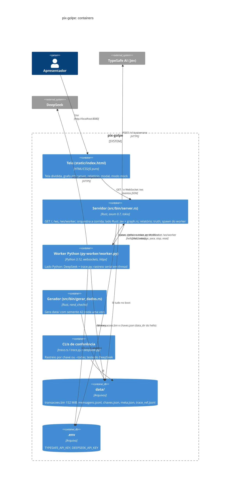

# C4 Nível 2: Containers

> Gerado pelo Architect (Reversa) em 2026-09-21. 🟢

## Comunicação

| De → Para | Canal | Conteúdo |
|---|---|---|
| Browser → Servidor | WS `/ws` | `start`, `pace`, `stop`, `report`, `reset` |
| Servidor → Browser | WS `/ws` (broadcast 8192) | `status`×2 no connect; `run`, `message`, `pace`, `stop`, `reset`, `decision`, `trace`(+truth), `error`, `done`, `report` |
| Servidor → Worker | WS `/ws/worker` (canal dedicado) | `hello {data_dir}`, `run`, `message`, `pace`, `stop`, `reset` |
| Worker → Servidor | WS `/ws/worker` | `status`, `decision`, `trace`, `error`, `done` (servidor injeta `side`) |
| Servidor → Jev | HTTPS | 4 perguntas tipadas |
| Worker → DeepSeek | HTTPS | chat JSON mode |

## Processos e portas

- `server`: porta 8080, bind `0.0.0.0`; roda o lado Rust no próprio runtime tokio (rastreio em `spawn_blocking`).
- `worker.py`: processo filho com `kill_on_drop`; conecta em `127.0.0.1:8080`.
- Nenhum outro serviço: sem banco, sem cache, sem fila.
