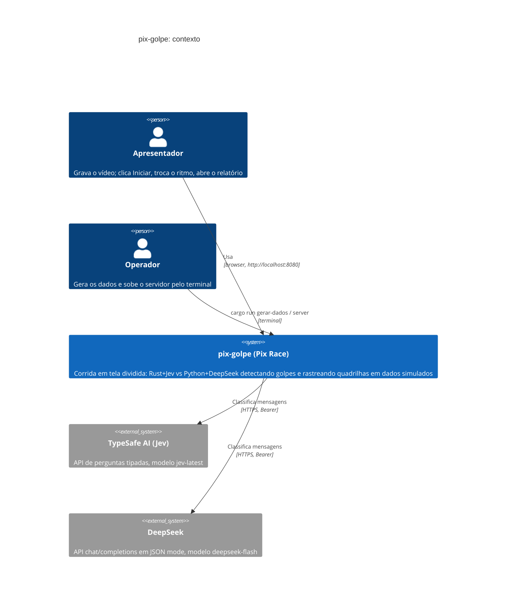

# C4 Nível 1: Contexto

> Gerado pelo Architect (Reversa) em 2026-09-21. 🟢

## Notas

- Não há outros usuários nem sistemas: sem banco, sem fila, sem auth.
- Os dois serviços externos recebem apenas remetente e texto da mensagem; a verdade de referência nunca sai do servidor.
- Nada é real: mensagens, contas, chaves e transações são sintéticas (ADR-003).
