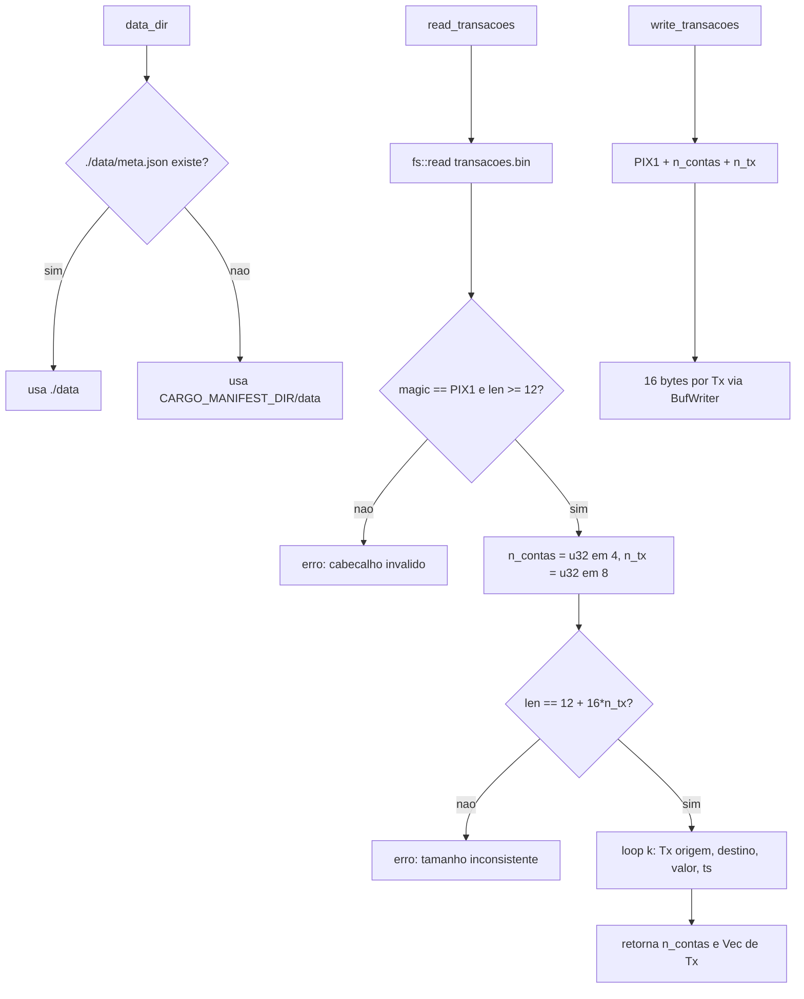

# Flowchart: módulo `data`

```mermaid
flowchart TD
    A[data_dir] --> B{./data/meta.json existe?}
    B -- sim --> C[usa ./data]
    B -- nao --> D[usa CARGO_MANIFEST_DIR/data]
    R[read_transacoes] --> R1[fs::read transacoes.bin]
    R1 --> R2{magic == PIX1 e len >= 12?}
    R2 -- nao --> E1[erro: cabecalho invalido]
    R2 -- sim --> R3[n_contas = u32 em 4, n_tx = u32 em 8]
    R3 --> R4{len == 12 + 16*n_tx?}
    R4 -- nao --> E2[erro: tamanho inconsistente]
    R4 -- sim --> R5[loop k: Tx origem, destino, valor, ts]
    R5 --> R6[retorna n_contas e Vec de Tx]
    W[write_transacoes] --> W1[PIX1 + n_contas + n_tx]
    W1 --> W2[16 bytes por Tx via BufWriter]
```
