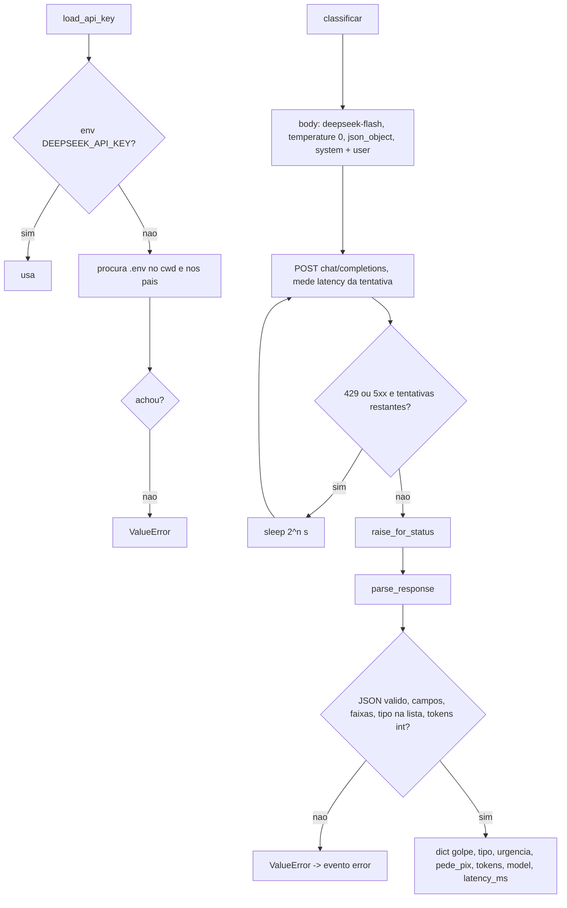

# Flowchart: módulo `deepseek`

```mermaid
flowchart TD
    K[load_api_key] --> K1{env DEEPSEEK_API_KEY?}
    K1 -- sim --> K2[usa]
    K1 -- nao --> K3[procura .env no cwd e nos pais] --> K4{achou?}
    K4 -- nao --> KX[ValueError]
    C[classificar] --> C1[body: deepseek-flash, temperature 0, json_object, system + user]
    C1 --> C2[POST chat/completions, mede latency da tentativa]
    C2 --> C3{429 ou 5xx e tentativas restantes?}
    C3 -- sim --> C4[sleep 2^n s] --> C2
    C3 -- nao --> C5[raise_for_status]
    C5 --> C6[parse_response]
    C6 --> C7{JSON valido, campos, faixas, tipo na lista, tokens int?}
    C7 -- nao --> CX[ValueError -> evento error]
    C7 -- sim --> C8[dict golpe, tipo, urgencia, pede_pix, tokens, model, latency_ms]
```
