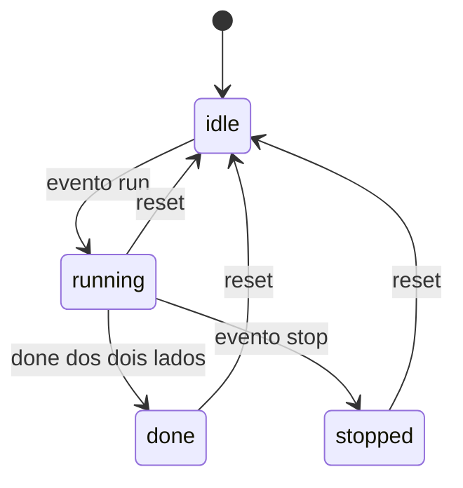
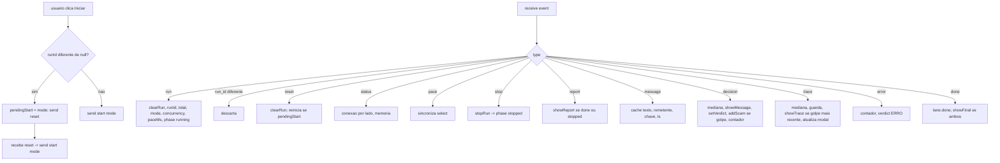

# Flowchart: módulo `frontend`

## Fases da tela

```mermaid
stateDiagram-v2
    [*] --> idle
    idle --> running : evento run
    running --> done : done dos dois lados
    running --> stopped : evento stop
    running --> idle : reset
    done --> idle : reset
    stopped --> idle : reset
```

## Comandos e recepção de eventos

```mermaid
flowchart TD
    U[usuario clica Iniciar] --> U1{runId diferente de null?}
    U1 -- sim --> U2[pendingStart = mode; send reset] --> U3[recebe reset -> send start mode]
    U1 -- nao --> U4[send start mode]
    RX[receive event] --> R1{type}
    R1 -- run --> A1[clearRun, runId, total, mode, concurrency, paceMs, phase running]
    R1 -- run_id diferente --> DROP[descarta]
    R1 -- reset --> A2[clearRun; reinicia se pendingStart]
    R1 -- status --> A3[conexao por lado, memoria]
    R1 -- pace --> A4[sincroniza select]
    R1 -- stop --> A5[stopRun -> phase stopped]
    R1 -- report --> A6[showReport se done ou stopped]
    R1 -- message --> A7[cache texto, remetente, chave, ts]
    R1 -- decision --> A8[mediana, showMessage, setVerdict, addScam se golpe, contador]
    R1 -- trace --> A9[mediana, guarda, showTrace se golpe mais recente, atualiza modal]
    R1 -- error --> A10[contador, verdict ERRO]
    R1 -- done --> A11[lane.done; showFinal se ambos]
```
