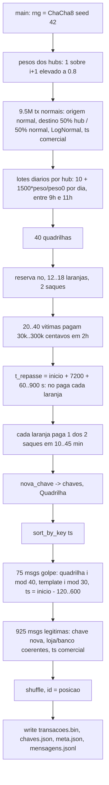

# Flowchart: módulo `gerar-dados`

```mermaid
flowchart TD
    S[main: rng = ChaCha8 seed 42] --> H[pesos dos hubs: 1 sobre i+1 elevado a 0.8]
    H --> N[9.5M tx normais: origem normal, destino 50% hub / 50% normal, LogNormal, ts comercial]
    N --> L[lotes diarios por hub: 10 + 1500*peso/peso0 por dia, entre 9h e 11h]
    L --> Q[40 quadrilhas]
    Q --> Q1[reserva no, 12..18 laranjas, 2 saques]
    Q1 --> Q2[20..40 vitimas pagam 30k..300k centavos em 2h]
    Q2 --> Q3[t_repasse = inicio + 7200 + 60..900 s: no paga cada laranja]
    Q3 --> Q4[cada laranja paga 1 dos 2 saques em 10..45 min]
    Q4 --> Q5[nova_chave -> chaves, Quadrilha]
    Q5 --> O[sort_by_key ts]
    O --> MG[75 msgs golpe: quadrilha i mod 40, template i mod 30, ts = inicio - 120..600]
    MG --> ML[925 msgs legitimas: chave nova, loja/banco coerentes, ts comercial]
    ML --> SH[shuffle, id = posicao]
    SH --> WR[write transacoes.bin, chaves.json, meta.json, mensagens.jsonl]
```
