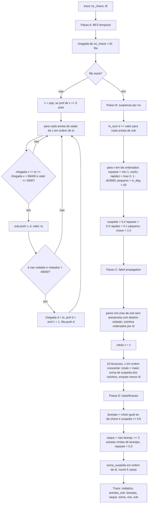

# Flowchart: módulo `graph` (Rust e Python idênticos)

```mermaid
flowchart TD
    T[trace no_chave, t0] --> A[Passo A: BFS temporal]
    A --> A1[chegada de no_chave = t0, fila]
    A1 --> A2{fila vazia?}
    A2 -- nao --> A3[v = pop; se prof de v == 5 pula]
    A3 --> A4[para cada aresta de saida de v em ordem de ts]
    A4 --> A5{chegada v <= ts <= chegada v + 86400 e valor >= 2000?}
    A5 -- nao --> A4
    A5 -- sim --> A6[sub.push v, d, valor, ts]
    A6 --> A7{d nao visitado e visitados < 40000?}
    A7 -- sim --> A8[chegada d = ts, prof d = prof v + 1, fila.push d]
    A7 -- nao --> A4
    A8 --> A4
    A2 -- sim --> B[Passo B: suspeicao por no]
    B --> B1[in_sum d += valor para cada aresta de sub]
    B1 --> B2[para v em ids ordenados: repasse = min 1, out/in; rapidez = max 0, 1 - dt/3600; pequeno = in_deg < 50]
    B2 --> B3[suspeita = 0.4 repasse + 0.5 rapidez + 0.1 pequeno; chave = 1.0]
    B3 --> C[Passo C: label propagation]
    C --> C1[pares min,max de sub sem autoaresta com destino visitado; vizinhos ordenados por id]
    C1 --> C2[rotulo v = v]
    C2 --> C3[10 iteracoes, v em ordem crescente: rotulo = maior soma de suspeita dos vizinhos, empate menor id]
    C3 --> D[Passo D: classificacao]
    D --> D1[laranjas = rotulo igual ao da chave e suspeita >= 0.6]
    D1 --> D2[saque = nao laranja, >= 3 arestas vindas de laranjas, repasse < 0.3]
    D2 --> D3[soma_suspeita em ordem de id, round 4 casas]
    D3 --> R[Trace: visitados, arestas_sub, laranjas, saque, soma, nos, sub]
```
