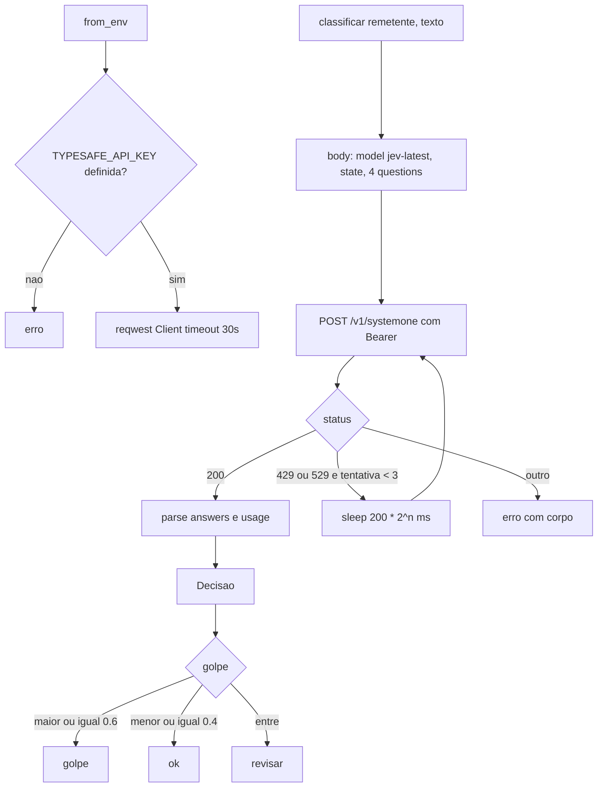

# Flowchart: módulo `jev`

```mermaid
flowchart TD
    E[from_env] --> E1{TYPESAFE_API_KEY definida?}
    E1 -- nao --> X[erro]
    E1 -- sim --> E2[reqwest Client timeout 30s]
    C[classificar remetente, texto] --> C1[body: model jev-latest, state, 4 questions]
    C1 --> C2[POST /v1/systemone com Bearer]
    C2 --> C3{status}
    C3 -- 200 --> C4[parse answers e usage] --> C5[Decisao]
    C3 -- 429 ou 529 e tentativa < 3 --> C6[sleep 200 * 2^n ms] --> C2
    C3 -- outro --> C7[erro com corpo]
    C5 --> V{golpe}
    V -- maior ou igual 0.6 --> G[golpe]
    V -- menor ou igual 0.4 --> O[ok]
    V -- entre --> R[revisar]
```
