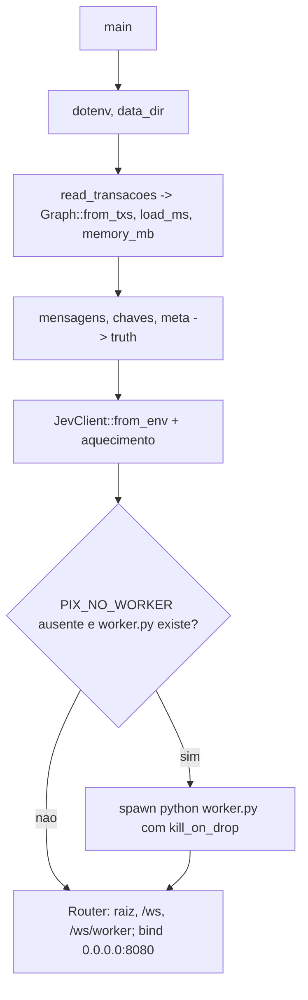
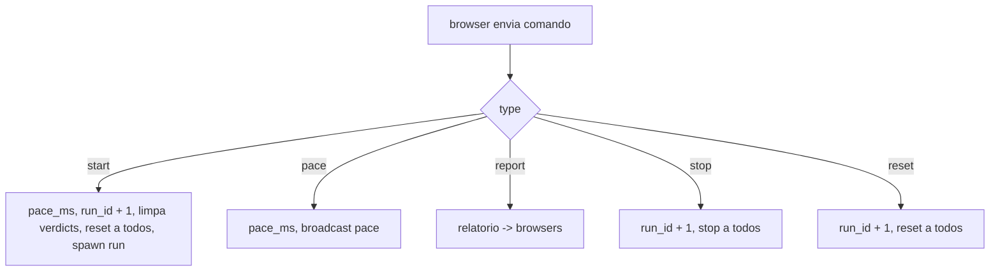
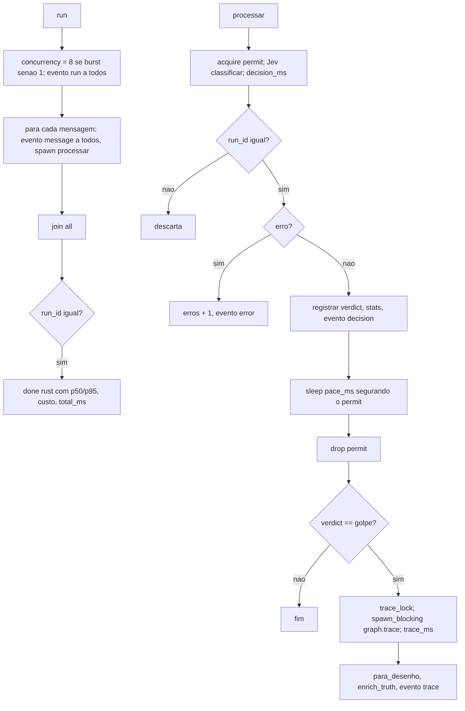
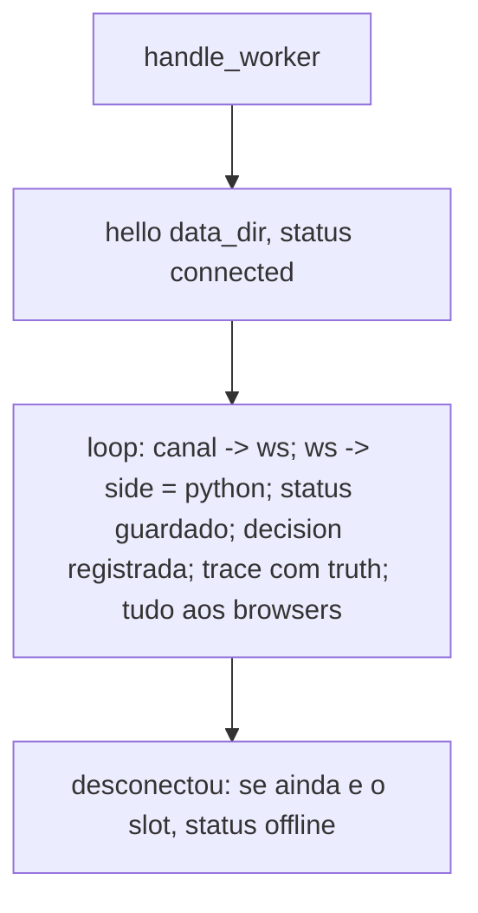

# Flowchart: módulo `server`

## Inicialização

```mermaid
flowchart TD
    M[main] --> M1[dotenv, data_dir]
    M1 --> M2[read_transacoes -> Graph::from_txs, load_ms, memory_mb]
    M2 --> M3[mensagens, chaves, meta -> truth]
    M3 --> M4[JevClient::from_env + aquecimento]
    M4 --> M5{PIX_NO_WORKER ausente e worker.py existe?}
    M5 -- sim --> M6[spawn python worker.py com kill_on_drop]
    M5 -- nao --> M7
    M6 --> M7[Router: raiz, /ws, /ws/worker; bind 0.0.0.0:8080]
```

## Comandos do browser

```mermaid
flowchart TD
    B[browser envia comando] --> B1{type}
    B1 -- start --> S1[pace_ms, run_id + 1, limpa verdicts, reset a todos, spawn run]
    B1 -- pace --> S2[pace_ms, broadcast pace]
    B1 -- report --> S3[relatorio -> browsers]
    B1 -- stop --> S4[run_id + 1, stop a todos]
    B1 -- reset --> S5[run_id + 1, reset a todos]
```

## Corrida e processamento de uma mensagem (lado Rust)

```mermaid
flowchart TD
    RUN[run] --> R1[concurrency = 8 se burst senao 1; evento run a todos]
    R1 --> R2[para cada mensagem: evento message a todos, spawn processar]
    R2 --> R3[join all] --> R4{run_id igual?}
    R4 -- sim --> R5[done rust com p50/p95, custo, total_ms]

    P[processar] --> P1[acquire permit; Jev classificar; decision_ms]
    P1 --> P2{run_id igual?}
    P2 -- nao --> PX[descarta]
    P2 -- sim --> P3{erro?}
    P3 -- sim --> P4[erros + 1, evento error]
    P3 -- nao --> P5[registrar verdict, stats, evento decision]
    P5 --> P6[sleep pace_ms segurando o permit] --> P7[drop permit]
    P7 --> P8{verdict == golpe?}
    P8 -- nao --> PE[fim]
    P8 -- sim --> P9[trace_lock; spawn_blocking graph.trace; trace_ms]
    P9 --> P10[para_desenho, enrich_truth, evento trace]
```

## Worker

```mermaid
flowchart TD
    W[handle_worker] --> W1[hello data_dir, status connected]
    W1 --> W2[loop: canal -> ws; ws -> side = python; status guardado; decision registrada; trace com truth; tudo aos browsers]
    W2 --> W3[desconectou: se ainda e o slot, status offline]
```
