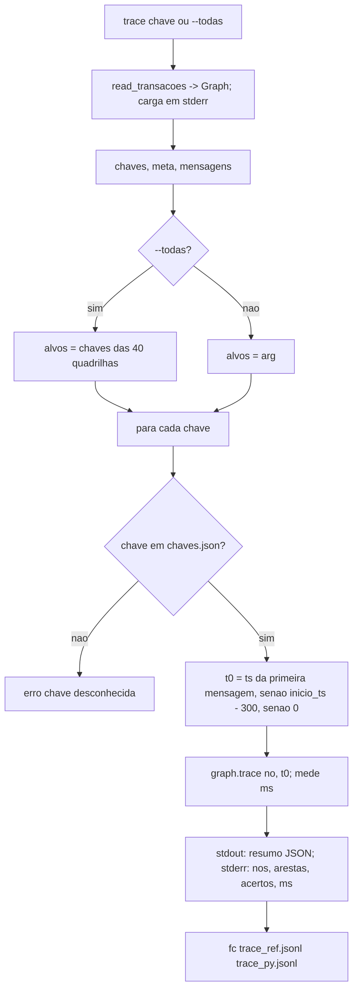

# Flowchart: módulo `trace-cli`

```mermaid
flowchart TD
    A[trace chave ou --todas] --> B[read_transacoes -> Graph; carga em stderr]
    B --> C[chaves, meta, mensagens]
    C --> D{--todas?}
    D -- sim --> E[alvos = chaves das 40 quadrilhas]
    D -- nao --> F[alvos = arg]
    E --> G[para cada chave]
    F --> G
    G --> H{chave em chaves.json?}
    H -- nao --> HX[erro chave desconhecida]
    H -- sim --> I[t0 = ts da primeira mensagem, senao inicio_ts - 300, senao 0]
    I --> J[graph.trace no, t0; mede ms]
    J --> K[stdout: resumo JSON; stderr: nos, arestas, acertos, ms]
    K --> L[fc trace_ref.jsonl trace_py.jsonl]
```
