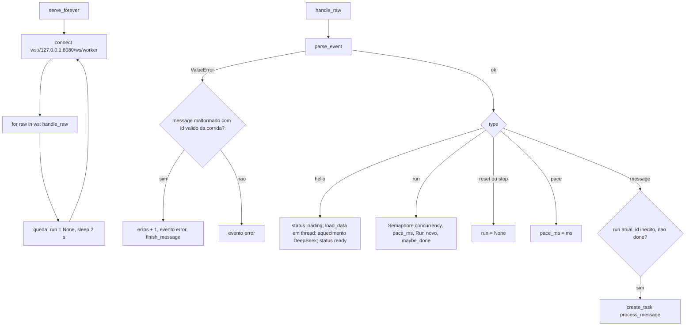
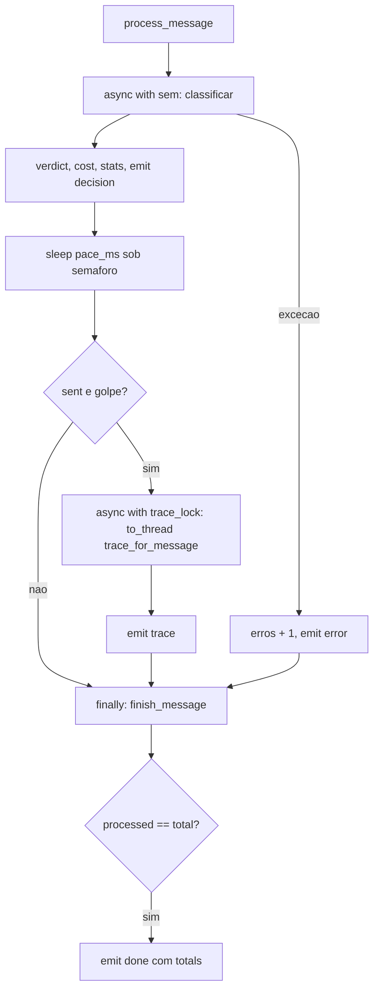

# Flowchart: módulo `worker`

```mermaid
flowchart TD
    S[serve_forever] --> S1[connect ws://127.0.0.1:8080/ws/worker]
    S1 --> S2[for raw in ws: handle_raw]
    S2 --> S3[queda: run = None, sleep 2 s] --> S1
    H[handle_raw] --> H1[parse_event]
    H1 -- ValueError --> H2{message malformado com id valido da corrida?}
    H2 -- sim --> H3[erros + 1, evento error, finish_message]
    H2 -- nao --> H4[evento error]
    H1 -- ok --> E{type}
    E -- hello --> E1[status loading; load_data em thread; aquecimento DeepSeek; status ready]
    E -- run --> E2[Semaphore concurrency, pace_ms, Run novo, maybe_done]
    E -- reset ou stop --> E3[run = None]
    E -- pace --> E4[pace_ms = ms]
    E -- message --> E5{run atual, id inedito, nao done?}
    E5 -- sim --> E6[create_task process_message]
```

```mermaid
flowchart TD
    P[process_message] --> P1[async with sem: classificar]
    P1 --> P2[verdict, cost, stats, emit decision]
    P2 --> P3[sleep pace_ms sob semaforo]
    P3 --> P4{sent e golpe?}
    P4 -- nao --> PF[finally: finish_message]
    P4 -- sim --> P5[async with trace_lock: to_thread trace_for_message]
    P5 --> P6[emit trace] --> PF
    P1 -- excecao --> PE[erros + 1, emit error] --> PF
    PF --> D{processed == total?}
    D -- sim --> DN[emit done com totals]
```
