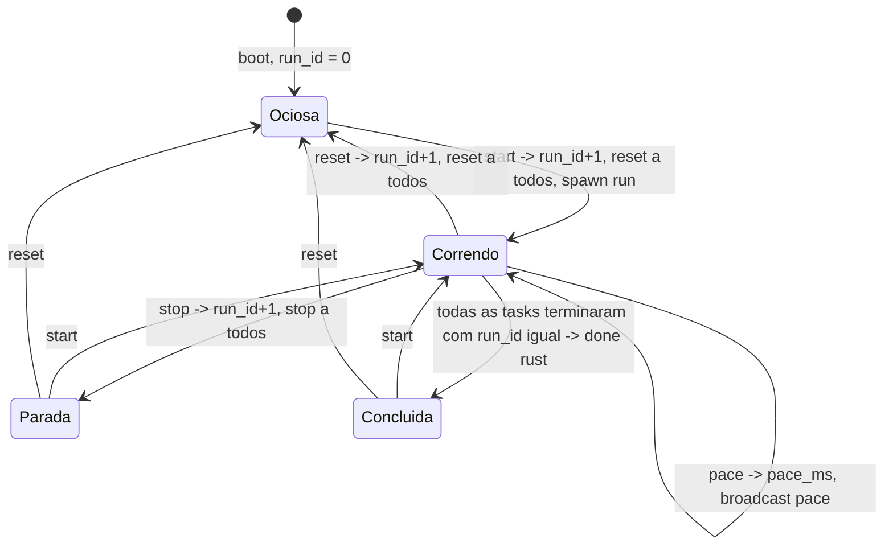
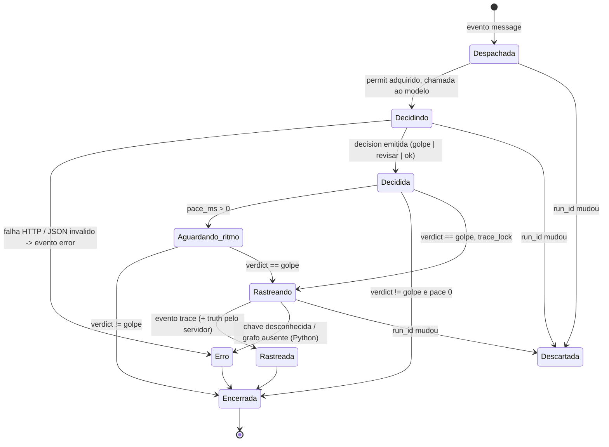
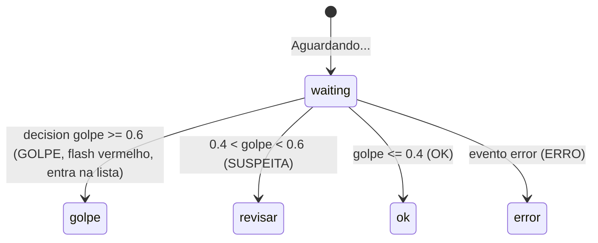
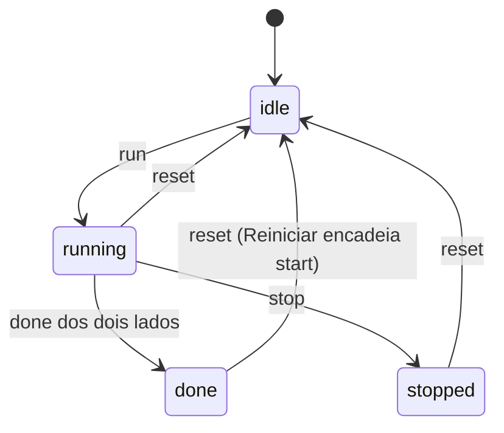
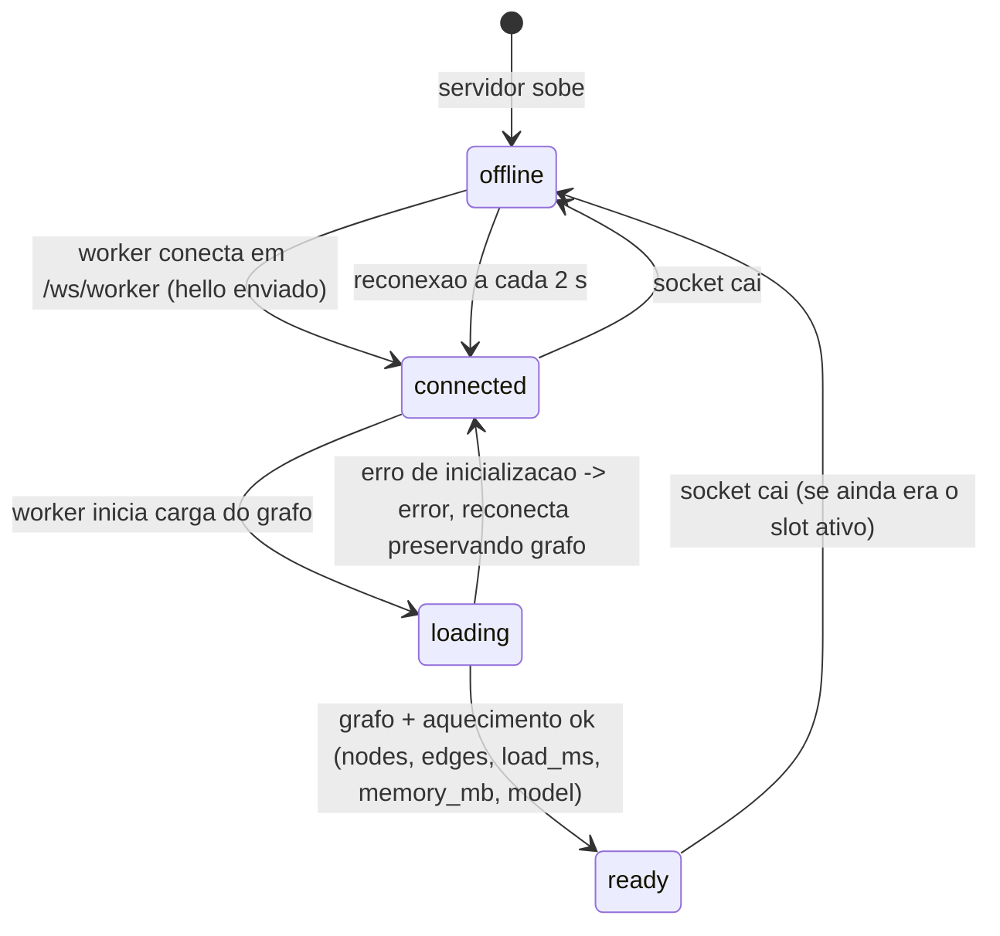
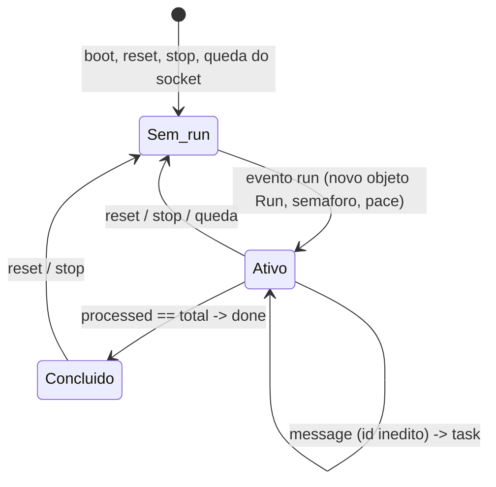
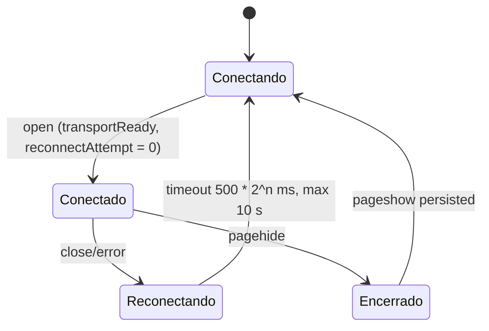

# Máquinas de estado: pix-golpe

> Gerado pelo Detective (Reversa) em 2026-09-21. 🟢 CONFIRMADO salvo indicação.

## 1. Corrida no servidor (`run_id` / `pace_ms`) 🟢

O servidor não guarda um enum de estado; a corrida "atual" é o `run_id` mais recente. Toda transição incrementa `run_id`, o que invalida tarefas em voo.

Gatilhos: comandos do browser (`server.rs:261-292`). `report` não muda estado; usa `verdicts` da corrida atual.

## 2. Mensagem em um lado 🟢

Rust: `server.rs:336-402`. Python: `worker.py:246-286` (o `finally` sempre chama `finish_message`, então Erro também conta para `done`).

## 3. Veredito de uma mensagem (tela) 🟢

Terminal por mensagem; a bolha da lane mostra sempre a última decisão (`setVerdict`, `index.html:1000-1020`).

## 4. Fase da tela (`phase`) 🟢

Regras: em `stopped` nenhum evento altera a tela; `report` só em `done` ou `stopped`; botão principal mostra Iniciar / Parar / Reiniciar conforme `phase` e `runId` (`updateControls`).

## 5. Conexão do lado Python (`status.state`) 🟢

Lado Rust: nasce `ready` no boot (`server.rs:179`). Um worker novo pode assumir o slot; o antigo, ao cair, não marca `offline` (`server.rs:444-459`).

## 6. Worker Python: `Run` 🟢

Identidade por objeto: tarefas antigas comparam `self.run is run` e descartam resultados (`worker.py:249-277`).

## 7. Conexão WebSocket do browser 🟢

Em modo mock a conexão é sempre "Simulação local".
