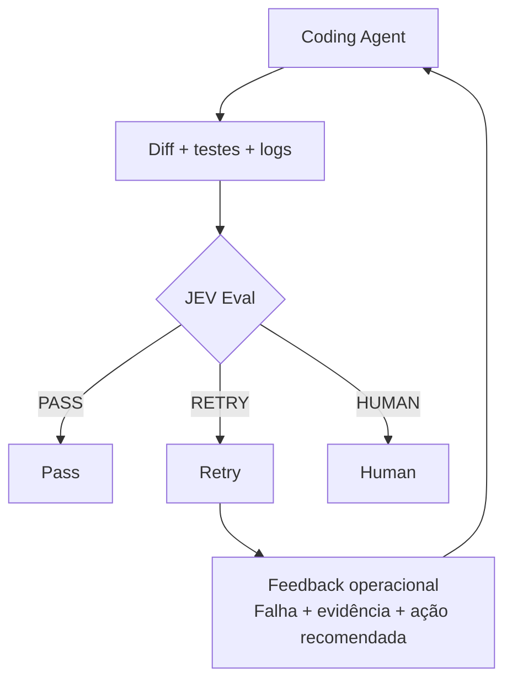
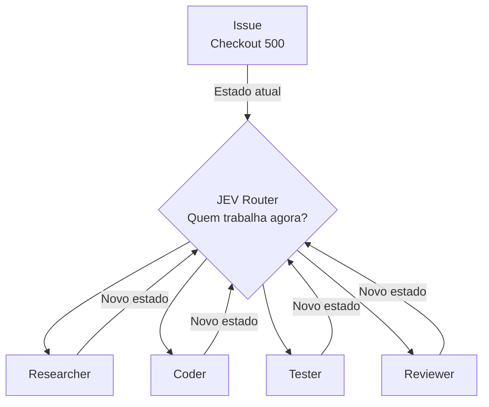
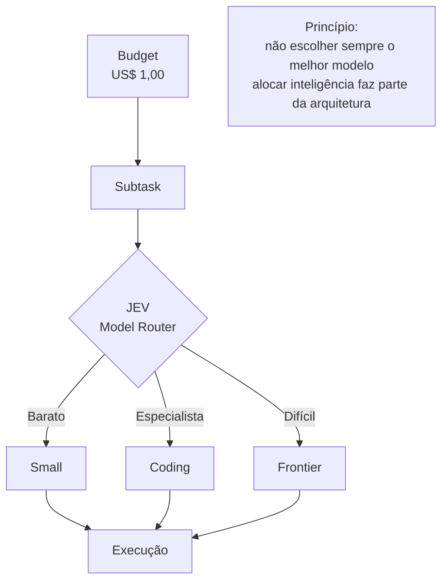
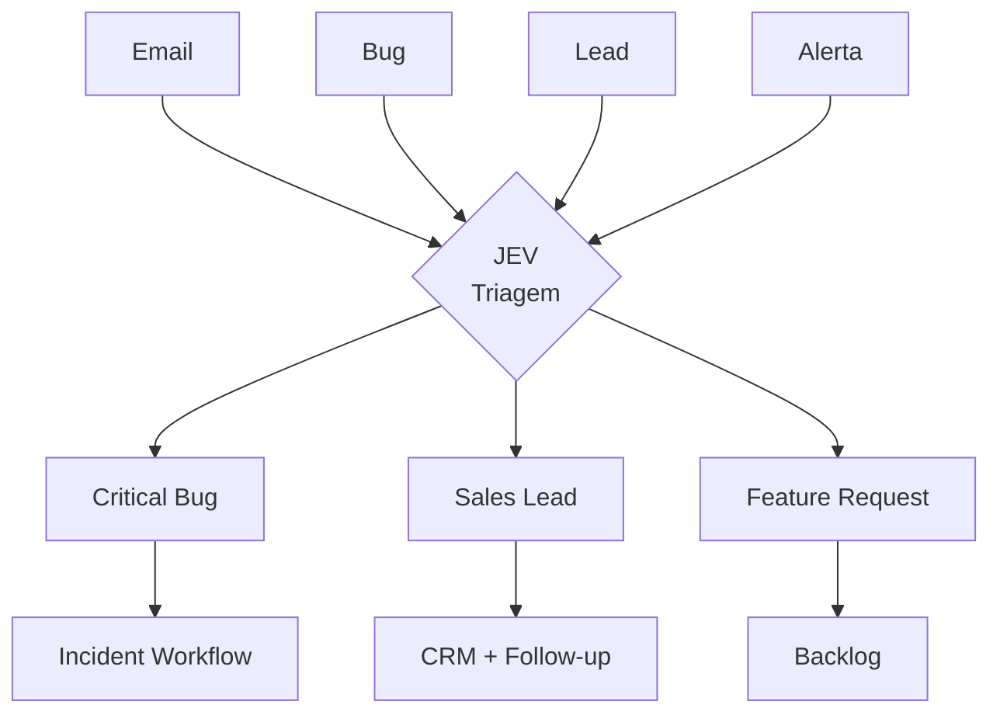
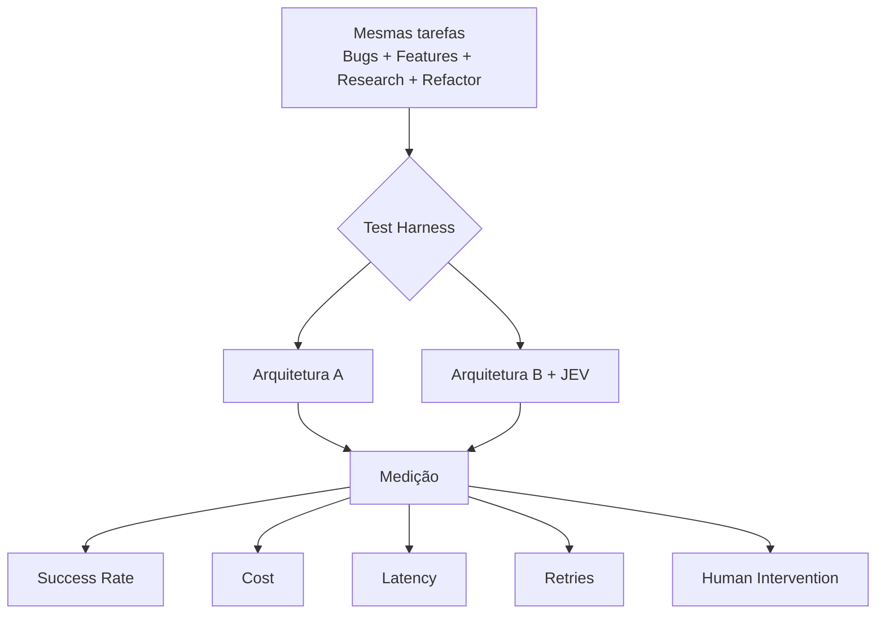

# Fluxos JEV — códigos Mermaid

## Fluxo 1 — Coding Agent + JEV Eval

## Fluxo 2 — Loop agêntico para agendar uma consulta

```mermaid
flowchart LR
    A["REQUEST<br/>Agende um dermatologista<br/>na semana que vem à tarde"]
        --> B["1. ESTADO DO AGENTE<br/>Objetivo + contexto<br/>Histórico + restrições"]

    B --> C{"JEV<br/>Qual é a próxima ação?"}
    C -->|SEARCH_SLOT| D["2. TOOL CALL<br/>Buscar disponibilidade"]
    D --> E["3. OBSERVAÇÃO<br/>Horários encontrados"]
    E --> F["4. NOVO ESTADO<br/>Memória atualizada"]
    F --> G{"JEV<br/>Próximo passo?"}
    G -->|NEED_USER| H["5. ASK USER<br/>Encontrei 3 horários.<br/>Qual você prefere?"]
    H --> I["USUÁRIO<br/>Quarta às 16:30"]
    I --> J["6. ESTADO ATUALIZADO<br/>Horário escolhido"]
    J --> K{"JEV<br/>Próxima ação?"}
    K -->|BOOK_SLOT| L["7. TOOL CALL<br/>Reservar horário"]
    L --> M["8. OBSERVAÇÃO<br/>Reserva confirmada"]
    M --> N{"JEV<br/>Terminou?"}
    N -->|DONE| O["9. RESPOSTA FINAL<br/>Consulta confirmada<br/>quarta às 16:30"]

    E -. "resultado vira novo estado" .-> C
```

## Fluxo 3 — Orquestração de agentes

## Fluxo 4 — Orquestração de modelos

## Fluxo 5 — Triagem

## Fluxo 6 — Benchmark

